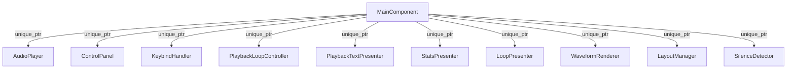
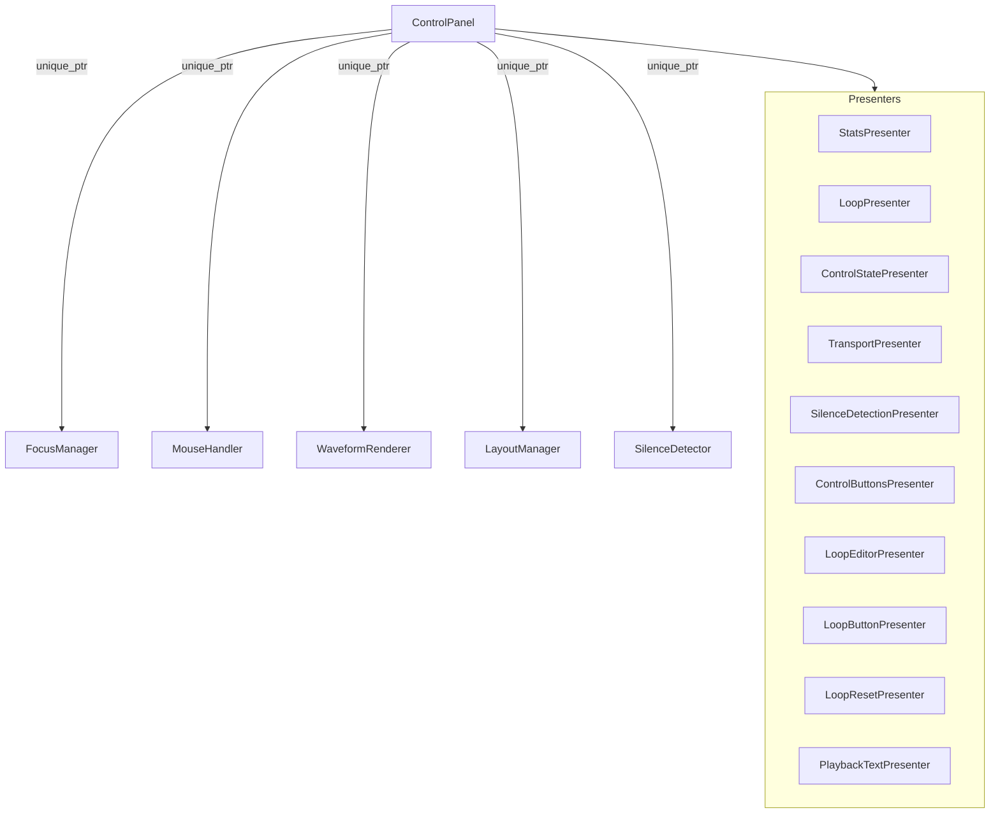

# Audiofiler Architectural Map

This document traces the "wires" of the application, showing ownership (Lifetimes) and references (Connections).

## 1. High-Level Ownership (The "Tree")

`MainComponent` is the root. It owns the core engines and the main UI.

## 2. ControlPanel Composition (The "Hub")

`ControlPanel` is the UI hub. It breaks down into "Lego bricks" — specialized managers and presenters.

## 3. The "Wires" (Data Flow & dependencies)

Components often need to talk to each other. We use references (`&`) for this, typically passed via constructors.

*   **FocusManager**: Owned by `ControlPanel`. Validates user intent (Drag > Scrub > Hover > Playback).
    *   *Queries*: `ControlPanel` state (is dragging? is scrubbing?).
*   **MouseHandler**: Owned by `ControlPanel`. Handles raw input.
    *   *Calls*: `ControlPanel::seekToPosition`, `FocusManager::getCurrentTarget` (implied logic).
*   **WaveformRenderer**: Owned by `ControlPanel`. Draws the screen.
    *   *Reads*: `ControlPanel::getWaveformBounds`, `AudioPlayer` (via CP), `FocusManager` (to know what to highlight).

## 4. Key Data Models

*   **AudioPlayer**: The source of truth for audio data (sample rate, position, thumbnail).
*   **Config.h**: Static configuration (colors, layout constants).
*   **AppEnums.h**: Shared enums (PlacementMode, ThumbnailQuality).
